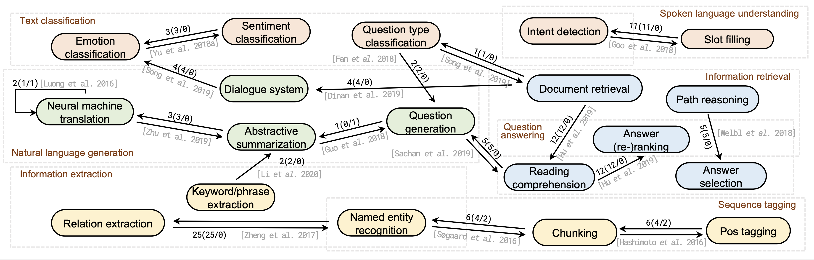

# MTKG-1.0

This repository contains the supplimentary information and a visualization system of multi-task knowledge graph.

## A subgraph example of multi-task KG.

 

Figure: A subgraph of MTKG-1.0. A bi-directional edge represents at least one joint training methods for the two tasks.A uni-directional edge represents at least one multi-step training methods for the two tasks. Three values are for the number of methods in MTKG-1.0 that considered the transfer, shared encoder parameters, and shared decoder parameters, respectively. An example paper that has been discussed in this survey is displayed around the edge.

## Statistic informaton of MTKG-1.0

| papers | nodes | edges | Avg.edge weight | Max.edge weight
| :---:  | :---: | :----: | :----: | :----: |
| 200 | 65 | 213 | 1.98 | 21 |

We constructed MTKG-1.0, based on 200 multi-task learn-ing NLP papers collected from top AI/NLP conferences andjournals, e.g., AAAI, IJCAI, ACL, EMNLP, NAACL, ICLR,NeurIPS, ICML, TACL, JMLR. 

## Visualization using D3

We set up a visualization system to demonstrate the MTKG-1.0 using D3. 

Here is the link to the website: http://159.89.9.22:5801/